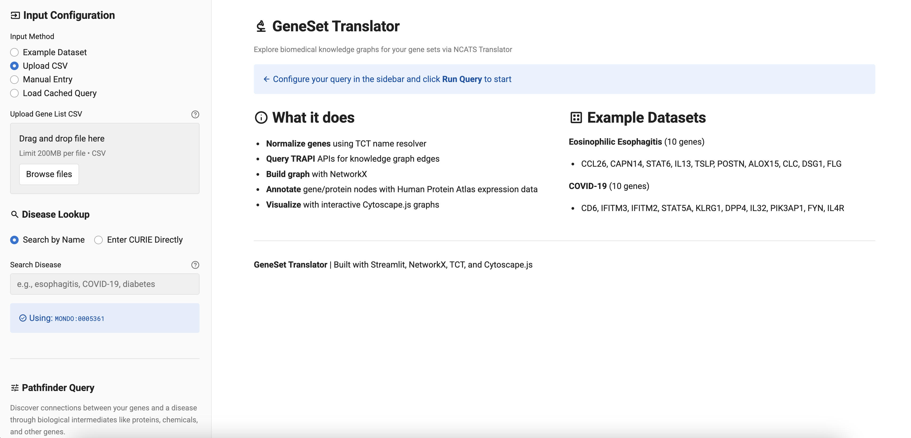

# GeneSet Translator

Explore biomedical knowledge graphs for gene sets via NCATS Translator.



## Features

- Query NCATS Translator APIs to explore gene neighborhoods and disease connections
- Interactive network visualization with Cytoscape.js
- Community detection and centrality analysis
- LLM-assisted summaries with citations (optional, requires API key)
- Support for custom gene lists or built-in example datasets

## Installation

### Prerequisites
- Python 3.11+
- [Poetry](https://python-poetry.org/docs/#installation)

### Setup

1. Clone and install:
   ```bash
   git clone https://github.com/gladstone-institutes/geneset_translator.git
   cd geneset_translator
   poetry install
   ```

2. (Optional) Enable LLM summaries:
   ```bash
   cp .env.example .env
   # Add your Anthropic API key to .env
   ```

If you have trouble installing the app dependencies, consider using Docker (instructions below).

## Usage

Run the app:
```bash
streamlit run app.py
```

### Docker

If you have [Docker](https://www.docker.com/) installed, you can run the app in a container without installing Python or Poetry:

```bash
./docker_run.sh
```

This pulls a pre-built image and runs the app. The script mounts your local `.env` (if present, for LLM summaries) and `data/` folder (for query caching).

### Quick Start
1. Select an example dataset
2. Choose a query pattern and intermediate node types
3. Click "Run Query" (takes 3-5 minutes)
4. Explore results in the Network, Overview, and Summary tabs

### Custom Genes
Upload a CSV with a `gene_symbol` column or enter genes manually in the sidebar.

## Troubleshooting

- **No results**: Some APIs may fail (5-6 successes is normal). Try different genes.
- **Empty graph**: Check disease CURIE format (e.g., `MONDO:0100096` for COVID-19)
- **Slow visualization**: Reduce the `max_intermediates` slider or use simpler layouts

## AI Disclosure

Generative AI tools (Claude Code, Anthropic) were used as coding assistants during development. The author maintains full responsibility for accuracy, reproducibility, and scientific validity. AI outputs were reviewed and validated before integration. Research questions, analytical approaches, and scientific interpretations were determined independently by the author.

## License

MIT License
