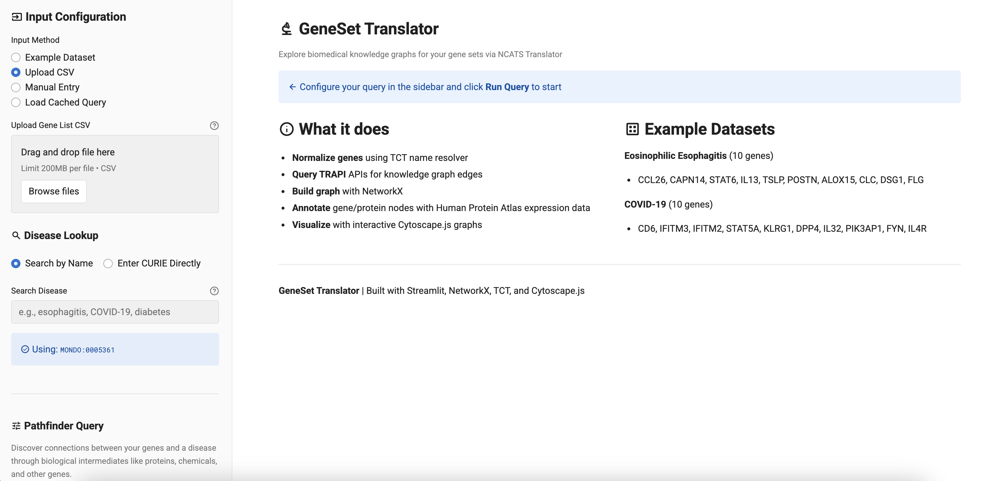
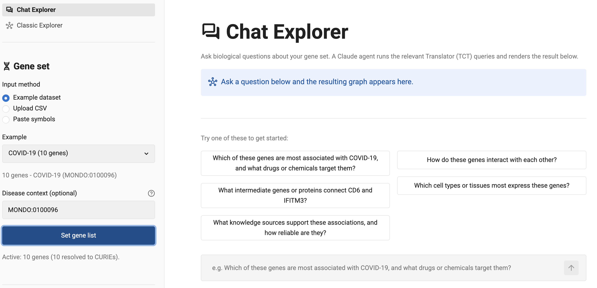
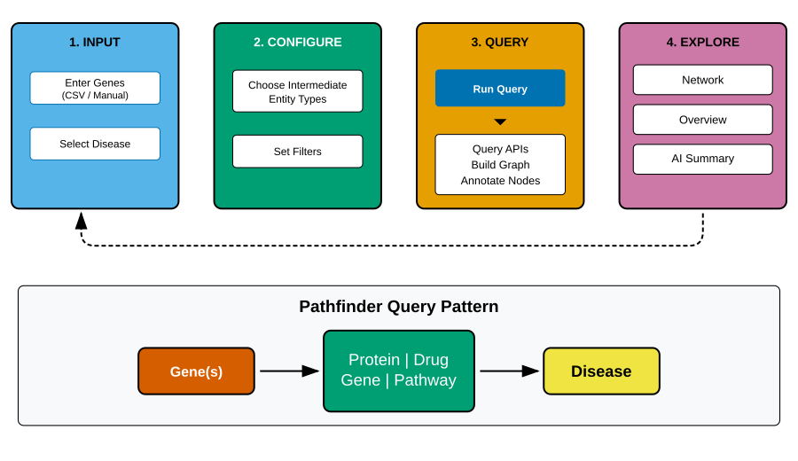

# GeneSet Translator

Explore biomedical knowledge graphs for gene sets via NCATS Translator, either through a
natural-language **AI Chat Explorer** (a Claude agent) or the form-based **Classic Explorer**.

## Classic



## Chat Explorer



## Features

### AI Chat Explorer (new in 2.0)

Ask biological questions about your gene set in plain English; a Claude agent runs the relevant NCATS
Translator (TCT) queries and renders the result for you.

- Gene neighborhoods, gene-to-gene interaction networks, and pathfinding between two entities
- Topology-aware clustering of large results into modules (or biolink-category facets when the network
  is hub-dominated), with the graph recolored by cluster
- Cell-type and tissue expression (Human Protein Atlas node annotation)
- Evidence-cited answers (publication links and primary knowledge sources from the data)
- Interactive Cytoscape.js graph with node-size, edge-width, layout, and edge-collapse controls
- Export the full (uncapped) graph to Cytoscape (`.cyjs`), the ranked results to CSV, or a standalone
  reproduction script
- Actual-usage cost tracking with a per-session spend cap, plus a Stop button to interrupt and
  course-correct the agent mid-run (price varies by agent type but typical sessions should cost less than $3)

The Chat Explorer requires an Anthropic API key (see [API Key](#api-key) below).

### Classic Explorer (no key required)

- Query NCATS Translator APIs to explore gene neighborhoods and disease connections
- Interactive network visualization with Cytoscape.js
- Human Protein Atlas integration for gene/protein cell type and tissue expression filtering
- LLM-assisted summaries with citations (optional, requires an API key)
- Support for custom gene lists or built-in example datasets

## How It Works (Classic)

<p align="center">
  
</p>

## Installation

### Prerequisites
- Python 3.11+
- [uv](https://docs.astral.sh/uv/getting-started/installation/)

### Setup

1. Clone and install:
   ```bash
   git clone https://github.com/gladstone-institutes/GeneSet_Translator.git
   cd GeneSet_Translator
   uv sync
   ```

2. (Optional) Enable the AI features:
   ```bash
   cp .env.example .env
   # Add your Anthropic API key to .env (see "API Key" below)
   ```

If you have trouble installing the app dependencies, consider using Docker (instructions below).

## API Key

The **Classic Explorer needs no key.** The **AI Chat Explorer** and the optional LLM summaries use
Anthropic's Claude and require an API key:

1. Create an account at the [Anthropic Console](https://console.anthropic.com/).
2. Add a payment method or credits. The API is pay-as-you-go and billed per token (this is separate
   from any Claude.ai chat subscription).
3. Open **API Keys** in the console and create a new key (it starts with `sk-ant-`).
4. Copy `.env.example` to `.env` in the project root and add the key:
   ```
   ANTHROPIC_API_KEY="sk-ant-..."
   ```
5. Restart the app. The Chat Explorer appears automatically once the key is detected.

**Cost control:** the Chat Explorer reports actual spend (from the API's reported usage)
and enforces the per-session "Max API spend" cap you set in the sidebar and the agent will be stopped if the token cost exceeds this value.
You can also pick a cheaper model (for example Haiku) and click **Stop** to halt a run at any time and course correct
the agent.

**Keep your key private.** `.env` is gitignored; never commit your key or share it.

## Usage

Run the app:
```bash
uv run streamlit run app.py
```

The app opens on the **Chat Explorer** when an API key is set, and on the **Classic Explorer**
otherwise. You can switch between them in the sidebar at any time.

### Docker

If you have [Docker](https://www.docker.com/) installed, you can run the app in a container without
installing Python or uv:

```bash
./docker_run.sh
```

This pulls a pre-built image and runs the app. The script mounts your local `.env` (if present, for the
AI features) and `data/` folder (for query caching).

### Video Tutorial

Coming soon.

### Quick Start: AI Chat Explorer

1. Set `ANTHROPIC_API_KEY` (see [API Key](#api-key)).
2. In the sidebar, pick an example dataset (or upload a CSV / paste gene symbols) and click
   **Set gene list**. Add a disease context to steer disease-anchored reasoning.
3. Ask a question, or click one of the suggested starters (for example
   "How do these genes interact with each other?").
4. The agent runs the Translator queries and renders the graph. Use the graph controls to restyle it,
   and download the full graph or a reproduction script from the buttons above the chat.

### Quick Start: Classic Explorer

1. Select an example dataset
2. Choose a query pattern and intermediate node types
3. Click "Run Query" (takes 10-15 minutes)
4. Explore results in the Network, Overview, and Summary tabs

### Custom Genes
Upload a CSV with a `gene_symbol` column or enter genes manually in the sidebar.

## Troubleshooting

- **AI Chat Explorer not showing**: ensure `ANTHROPIC_API_KEY` is set in `.env` and restart the app.
  The "Enable AI Chat" page explains the setup; the Classic Explorer always works without a key.
- **No results**: Some APIs may fail (5-6 successes is normal). Try different genes, or a less specific
  predicate filter.
- **Empty graph**: Check disease CURIE format (e.g., `MONDO:0100096` for COVID-19)
- **Slow visualization**: Reduce the max graph nodes setting or use simpler layouts. Translator queries
  themselves can take roughly a minute each; the Chat Explorer streams progress and can be stopped.

## AI Disclosure

Generative AI tools (Claude Code, Anthropic) were used as coding assistants during development. The author maintains full responsibility for accuracy, reproducibility, and scientific validity. AI outputs were reviewed and validated before integration. Research questions, analytical approaches, and scientific interpretations were determined independently by the author.

## License

MIT License
